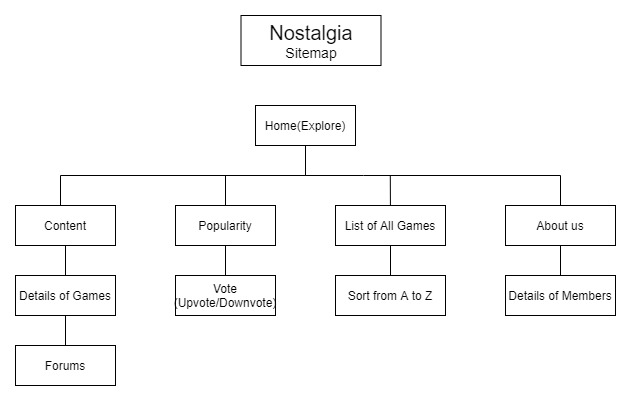

# Group-D---Nostalgia

Group D
‘Nostalgia’
Prepared by:
~Amir Syazwan bin Ramlan (1913373)
~Ahmad Ammar Arif bin Abdul Aziz (1919933)
~Amirul Afiq bin Shahdan (1916491)
~Muhammad Ilham Hakimi bin Mohamad Nizam (1914359)
‘Nostalgia’ is a website for an online based in Kuala Lumpur, Malaysia.

1. Project Description
   What is the first thing you have in mind when the nostalgia word come out? Of course, we tend to remember the past especially the beautiful moment that we surely cannot get rid of. As for us, the 2000’s kid or more known as the generation Z, we played a lot of games that is unique and have its own rules that need to be abided. For example, we have “Ceper” (bottle cap), “Gasing” (top), Eraser brawl, Clap Card, Yoyo, B-Daman and Bakugan. Apparently, some of games that we played are inspired from traditional games or from “Anime”.
   Our project intends to reminisce our wonderful childhood memories, playing games with our friends. We want society to relive these past moments, because all the little games once make us smile. This website helps us to accomplish our objective by spreading information about the games to the society. Our website also will be a place for people with same interest to gather. We provide a section for them to interact with each other.

2. Project Sitemap
   

3. Group Contributions

Each of the team members prepared 4 web pages for the project as shown in the following table.

Name Contributions
Amir Syazwan bin Ramlan (1913373)
• Pages: Home, Popularity, A-Z List, About Us, Kite
• Web elements: Images, Youtube video, List, Tabs
• Content for Kite page
• JavaScript event handlers for ranking (get data JSON, reordering and display) and Kite page

Ahmad Ammar Arif bin Abdul Aziz (1919933)
• Pages: Home, Popularity, Ceper
• Web elements: Image, Youtube video, Buttons, Tabs
• Content for Ceper page
• JavaScript event handlers for ranking (get data JSON, reordering and display) and using JqueryUI Ceper page

Amirul Afiq bin Shahdan (1916491)
• Pages: Home, Popularity, Super Yoyo, Site Maintenance
• Web elements: Logo, Images, Youtube video, List, Tabs, bottom horizontal scrollbar progress
• Content for Super Yoyo page
• JavaScript event handlers for ranking (get data JSON, reordering and display), for loading screen and using JqueryUI Super Yoyo page

Muhammad Ilham Hakimi bin Mohamad Nizam (1914359)
• Pages: Home, Popularity, Bakugan
• Web elements: Images, Youtube video, List, Tabs
• Content for Bakugan page
• JavaScript event handlers for ranking (get data JSON, reordering and display) and Bakugan page

4. Use of third party resources
   JQueryUI - Tab Widget (for contents on content page)
   AJAX - XMLHttpRequest (get data from JSON file)
   Facebook API - Social Plugim-Comments (for forum on content page)

5. References

   Comments - Social Plugin Retrieved 20 December 2020 from https://developers.facebook.com/docs/plugins/comments
   JavaScript: HTML Form - email validation Retrieved 5 December 2020 from https://www.w3resource.com/javascript/form/email-validation.php
   How To Create A Slideshow. Retrieved 5 December 2020 from https://www.w3schools.com/howto/howto_js_slideshow.asp
   How To Create An Grid Image. Retrieved 5 December 2020 from https://www.w3schools.com/howto/howto_js_image_grid.asp
   How to create json file with data || JSON Basics Retrieved 5 December 2020 from https://www.youtube.com/watch?v=ot5h1FFy7jk
   Kite Flying Tips Retrieved 15 December 2020 from https://store.kittyhawk.com/pages/kite-flying-tips#:~:text=Hold%20your%20kite%20up%20by
   Bakugan Battle Brawlers - Wikipedia Retrieved 15 December 2020 from https://en.wikipedia.org/wiki/Bakugan_Battle_Brawlers
   How to play Ceper / Tutup Botol / Bottle Caps Retrieved 15 December 2020 from https://www.youtube.com/watch?v=D3rOOzYPHe8
   Jquery #4 - Work on tabs using JQuery Retrieved 15 December 2020 from https://www.youtube.com/watch?v=wM872iEqCfI&list=PLiUrl-SQRR7Ix1S4lm4XPW7DU5Ztv9erB&index=4
   YoYo Wiki | Fandom Retrieved 15 December 2020 from https://yoyo.fandom.com/wiki/Main_Page

----------------------- END OF README ----------------------
